# [📈 Live Status](https://uptime.hydev.org): <!--live status--> **🟧 Partial outage**

This repository contains the open-source uptime monitor and status page for [Azalea](aza.moe), powered by [Upptime](https://github.com/upptime/upptime).

With [Upptime](https://upptime.js.org), you can get your own unlimited and free uptime monitor and status page, powered entirely by a GitHub repository. We use [Issues](https://github.com/hykilpikonna/upptime/issues) as incident reports, [Actions](https://github.com/hykilpikonna/upptime/actions) as uptime monitors, and [Pages](https://uptime.hydev.org) for the status page.

<!--start: status pages-->
<!-- This summary is generated by Upptime (https://github.com/upptime/upptime) -->
<!-- Do not edit this manually, your changes will be overwritten -->
<!-- prettier-ignore -->
| URL | Status | History | Response Time | Uptime |
| --- | ------ | ------- | ------------- | ------ |
|  [Link Shortener (lisho)](https://sh.hydev.org) | 🟩 Up | [link-shortener-lisho.yml](https://github.com/hykilpikonna/upptime/commits/HEAD/history/link-shortener-lisho.yml) | 

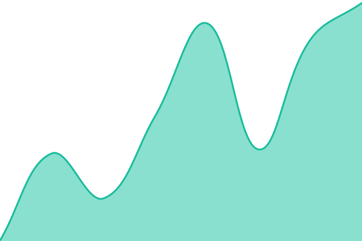 357ms
     
 | 

<a href="https://uptime.hydev.org/history/link-shortener-lisho">100.00%</a>
    

|  [File Server](https://hydev.org) | 🟩 Up | [file-server.yml](https://github.com/hykilpikonna/upptime/commits/HEAD/history/file-server.yml) | 

 689ms
     
 | 

<a href="https://uptime.hydev.org/history/file-server">100.00%</a>
    

|  [Matrix Synapse](https://hydev.org/_matrix/static/) | 🟩 Up | [matrix-synapse.yml](https://github.com/hykilpikonna/upptime/commits/HEAD/history/matrix-synapse.yml) | 

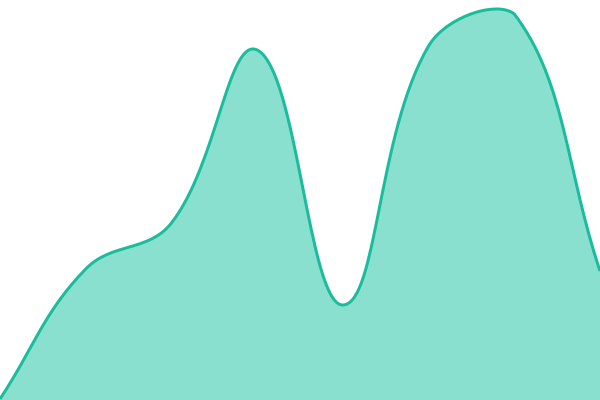 227ms
     
 | 

<a href="https://uptime.hydev.org/history/matrix-synapse">100.00%</a>
    

|  [One Among Us GitHub Webhook](https://hydev.org/_github) | 🟩 Up | [one-among-us-git-hub-webhook.yml](https://github.com/hykilpikonna/upptime/commits/HEAD/history/one-among-us-git-hub-webhook.yml) | 

 127ms
     
 | 

<a href="https://uptime.hydev.org/history/one-among-us-git-hub-webhook">100.00%</a>
    

|  [One Among Us Telegram Backup](https://hydev.org/backup) | 🟩 Up | [one-among-us-telegram-backup.yml](https://github.com/hykilpikonna/upptime/commits/HEAD/history/one-among-us-telegram-backup.yml) | 

 372ms
     
 | 

<a href="https://uptime.hydev.org/history/one-among-us-telegram-backup">100.00%</a>
    

|  [Amaoke](https://amaoke.app) | 🟩 Up | [amaoke.yml](https://github.com/hykilpikonna/upptime/commits/HEAD/history/amaoke.yml) | 

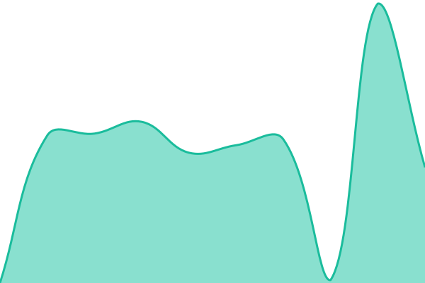 1176ms
     
 | 

<a href="https://uptime.hydev.org/history/amaoke">100.00%</a>
    

|  [Voice Tools Backend](https://voice-backend.hydev.org) | 🟩 Up | [voice-tools-backend.yml](https://github.com/hykilpikonna/upptime/commits/HEAD/history/voice-tools-backend.yml) | 

 287ms
     
 | 

<a href="https://uptime.hydev.org/history/voice-tools-backend">100.00%</a>
    

|  [Whisper Transcription Backend](https://whisper.hydev.org) | 🟩 Up | [whisper-transcription-backend.yml](https://github.com/hykilpikonna/upptime/commits/HEAD/history/whisper-transcription-backend.yml) | 

 236ms
     
 | 

<a href="https://uptime.hydev.org/history/whisper-transcription-backend">100.00%</a>
    

|  [Sekai LLM Inference](https://sekai.aquadx.net/llm/health) | 🟥 Down | [sekai-llm-inference.yml](https://github.com/hykilpikonna/upptime/commits/HEAD/history/sekai-llm-inference.yml) | 

 715ms
     
 | 

<a href="https://uptime.hydev.org/history/sekai-llm-inference">100.00%</a>
    

|  [Camellia Stable Diffusion](https://camellia-sd.hydev.org/Text2Image) | 🟩 Up | [camellia-stable-diffusion.yml](https://github.com/hykilpikonna/upptime/commits/HEAD/history/camellia-stable-diffusion.yml) | 

 835ms
     
 | 

<a href="https://uptime.hydev.org/history/camellia-stable-diffusion">100.00%</a>
    

|  [Tulip Host](https://tulip.hydev.org) | 🟥 Down | [tulip-host.yml](https://github.com/hykilpikonna/upptime/commits/HEAD/history/tulip-host.yml) | 

 0ms
     
 | 

<a href="https://uptime.hydev.org/history/tulip-host">100.00%</a>
    

|  [Profile API](https://profile-api.hydev.org) | 🟩 Up | [profile-api.yml](https://github.com/hykilpikonna/upptime/commits/HEAD/history/profile-api.yml) | 

 238ms
     
 | 

<a href="https://uptime.hydev.org/history/profile-api">100.00%</a>
    

|  [Project Instant](https://p.hydev.org) | 🟥 Down | [project-instant.yml](https://github.com/hykilpikonna/upptime/commits/HEAD/history/project-instant.yml) | 

 0ms
     
 | 

<a href="https://uptime.hydev.org/history/project-instant">100.00%</a>
    

|  [Telegram Channel Tree](https://tree.aza.moe) | 🟩 Up | [telegram-channel-tree.yml](https://github.com/hykilpikonna/upptime/commits/HEAD/history/telegram-channel-tree.yml) | 

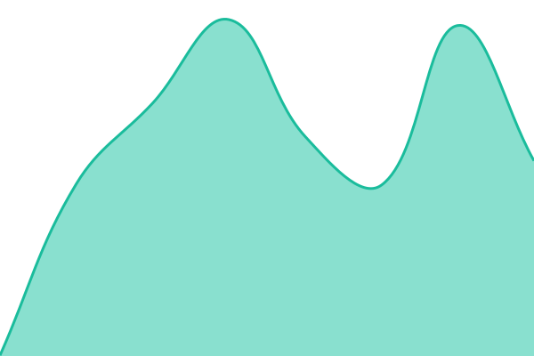 407ms
     
 | 

<a href="https://uptime.hydev.org/history/telegram-channel-tree">100.00%</a>
    

|  [Grafana](https://grafana.hydev.org) | 🟩 Up | [grafana.yml](https://github.com/hykilpikonna/upptime/commits/HEAD/history/grafana.yml) | 

 425ms
     
 | 

<a href="https://uptime.hydev.org/history/grafana">100.00%</a>
    

|  [InfluxDB](https://influx.hydev.org) | 🟩 Up | [influx-db.yml](https://github.com/hykilpikonna/upptime/commits/HEAD/history/influx-db.yml) | 

 212ms
     
 | 

<a href="https://uptime.hydev.org/history/influx-db">100.00%</a>
    

|  [Minecraft Server](https://mc.hydev.org) | 🟩 Up | [minecraft-server.yml](https://github.com/hykilpikonna/upptime/commits/HEAD/history/minecraft-server.yml) | 

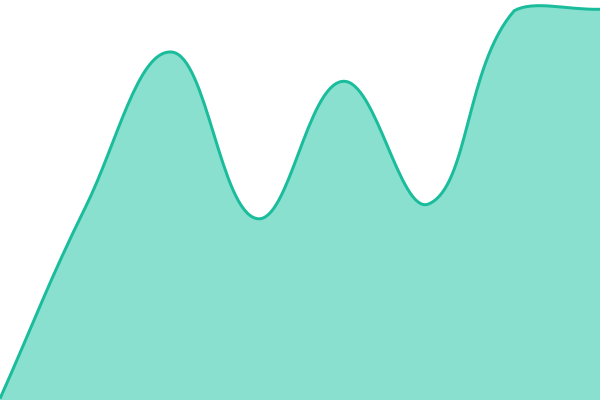 216ms
     
 | 

<a href="https://uptime.hydev.org/history/minecraft-server">100.00%</a>
    

|  [Slither Link](https://slither.hydev.org) | 🟩 Up | [slither-link.yml](https://github.com/hykilpikonna/upptime/commits/HEAD/history/slither-link.yml) | 

 249ms
     
 | 

<a href="https://uptime.hydev.org/history/slither-link">100.00%</a>
    

|  [Moderator Webhook](https://moderator-webhook.hydev.org) | 🟩 Up | [moderator-webhook.yml](https://github.com/hykilpikonna/upptime/commits/HEAD/history/moderator-webhook.yml) | 

 224ms
     
 | 

<a href="https://uptime.hydev.org/history/moderator-webhook">100.00%</a>
    

|  [Orizuru Staging](https://staging.orizuru.org) | 🟥 Down | [orizuru-staging.yml](https://github.com/hykilpikonna/upptime/commits/HEAD/history/orizuru-staging.yml) | 

 0ms
     
 | 

<a href="https://uptime.hydev.org/history/orizuru-staging">100.00%</a>
    

|  [Gitea](https://gitea.aza.moe) | 🟩 Up | [gitea.yml](https://github.com/hykilpikonna/upptime/commits/HEAD/history/gitea.yml) | 

 253ms
     
 | 

<a href="https://uptime.hydev.org/history/gitea">16.89%</a>
    

|  [DocuSeal](https://docuseal.hydev.org) | 🟩 Up | [docu-seal.yml](https://github.com/hykilpikonna/upptime/commits/HEAD/history/docu-seal.yml) | 

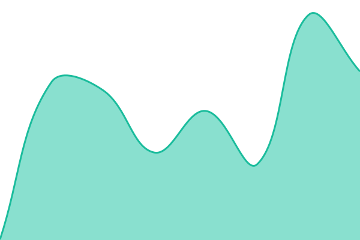 266ms
     
 | 

<a href="https://uptime.hydev.org/history/docu-seal">100.00%</a>
    

|  [Flowy Backend (CSC301)](https://301-bk.hydev.org) | 🟩 Up | [flowy-backend-csc-301.yml](https://github.com/hykilpikonna/upptime/commits/HEAD/history/flowy-backend-csc-301.yml) | 

 418ms
     
 | 

<a href="https://uptime.hydev.org/history/flowy-backend-csc-301">100.00%</a>
    

|  [MeetSphere (CSC309)](https://meet.hydev.org) | 🟩 Up | [meet-sphere-csc-309.yml](https://github.com/hykilpikonna/upptime/commits/HEAD/history/meet-sphere-csc-309.yml) | 

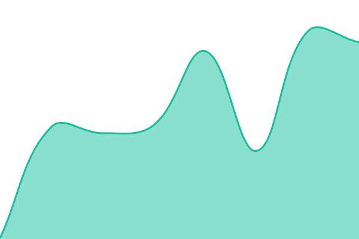 212ms
     
 | 

<a href="https://uptime.hydev.org/history/meet-sphere-csc-309">100.00%</a>
    

|  [Owncast](https://cast.hydev.org) | 🟩 Up | [owncast.yml](https://github.com/hykilpikonna/upptime/commits/HEAD/history/owncast.yml) | 

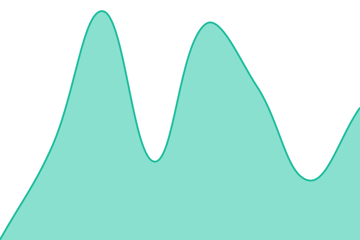 335ms
     
 | 

<a href="https://uptime.hydev.org/history/owncast">100.00%</a>
    

|  [Owncast Public](https://pcast.hydev.org) | 🟩 Up | [owncast-public.yml](https://github.com/hykilpikonna/upptime/commits/HEAD/history/owncast-public.yml) | 

 199ms
     
 | 

<a href="https://uptime.hydev.org/history/owncast-public">100.00%</a>
    

|  [Open WebUI](https://ow.hydev.org) | 🟩 Up | [open-web-ui.yml](https://github.com/hykilpikonna/upptime/commits/HEAD/history/open-web-ui.yml) | 

 217ms
     
 | 

<a href="https://uptime.hydev.org/history/open-web-ui">100.00%</a>
    

|  [SillyTavern](https://tavern.hydev.org) | 🟩 Up | [silly-tavern.yml](https://github.com/hykilpikonna/upptime/commits/HEAD/history/silly-tavern.yml) | 

 291ms
     
 | 

<a href="https://uptime.hydev.org/history/silly-tavern">100.00%</a>
    

|  [Jellyfin](https://jellyfin.hydev.org/health) | 🟩 Up | [jellyfin.yml](https://github.com/hykilpikonna/upptime/commits/HEAD/history/jellyfin.yml) | 

 164ms
     
 | 

<a href="https://uptime.hydev.org/history/jellyfin">100.00%</a>
    

|  [Immich](https://immich.hydev.org) | 🟩 Up | [immich.yml](https://github.com/hykilpikonna/upptime/commits/HEAD/history/immich.yml) | 

 242ms
     
 | 

<a href="https://uptime.hydev.org/history/immich">16.89%</a>
    

|  [Web Archive](https://archive.hydev.org) | 🟩 Up | [web-archive.yml](https://github.com/hykilpikonna/upptime/commits/HEAD/history/web-archive.yml) | 

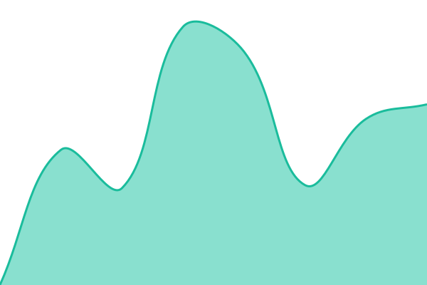 906ms
     
 | 

<a href="https://uptime.hydev.org/history/web-archive">100.00%</a>
    

|  [Home Assistant](https://home.hydev.org) | 🟩 Up | [home-assistant.yml](https://github.com/hykilpikonna/upptime/commits/HEAD/history/home-assistant.yml) | 

 219ms
     
 | 

<a href="https://uptime.hydev.org/history/home-assistant">100.00%</a>
    

|  [AquaDX](https://aquadx.net) | 🟩 Up | [aqua-dx.yml](https://github.com/hykilpikonna/upptime/commits/HEAD/history/aqua-dx.yml) | 

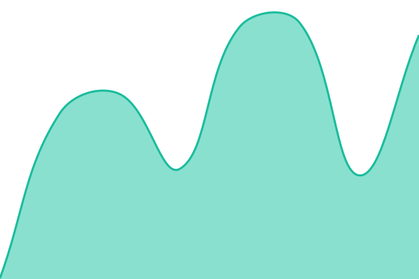 219ms
     
 | 

<a href="https://uptime.hydev.org/history/aqua-dx">100.00%</a>
    

|  [AquaDX Mirror](https://aquadx.hydev.org) | 🟥 Down | [aqua-dx-mirror.yml](https://github.com/hykilpikonna/upptime/commits/HEAD/history/aqua-dx-mirror.yml) | 

 0ms
     
 | 

<a href="https://uptime.hydev.org/history/aqua-dx-mirror">0.00%</a>
    

|  [Profile Redirect](https://profile.hydev.org) | 🟩 Up | [profile-redirect.yml](https://github.com/hykilpikonna/upptime/commits/HEAD/history/profile-redirect.yml) | 

 427ms
     
 | 

<a href="https://uptime.hydev.org/history/profile-redirect">100.00%</a>
    

|  [tg-blog Demo](https://test-tg.one-among.us) | 🟩 Up | [tg-blog-demo.yml](https://github.com/hykilpikonna/upptime/commits/HEAD/history/tg-blog-demo.yml) | 

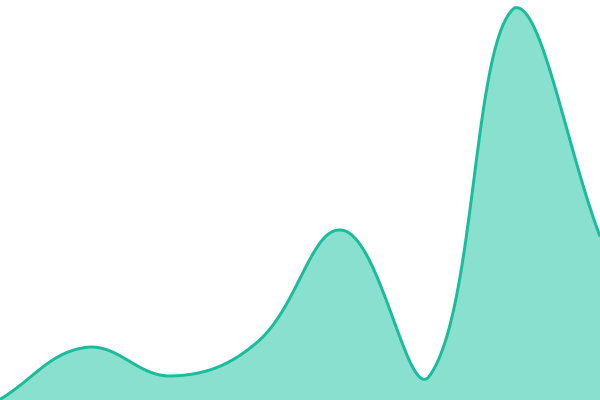 221ms
     
 | 

<a href="https://uptime.hydev.org/history/tg-blog-demo">100.00%</a>
    

|  [FAD Toolkit Paper](https://fadtk.hydev.org) | 🟩 Up | [fad-toolkit-paper.yml](https://github.com/hykilpikonna/upptime/commits/HEAD/history/fad-toolkit-paper.yml) | 

 184ms
     
 | 

<a href="https://uptime.hydev.org/history/fad-toolkit-paper">100.00%</a>
    

|  [Voice Tools Frontend](https://voice.hydev.org) | 🟩 Up | [voice-tools-frontend.yml](https://github.com/hykilpikonna/upptime/commits/HEAD/history/voice-tools-frontend.yml) | 

 209ms
     
 | 

<a href="https://uptime.hydev.org/history/voice-tools-frontend">100.00%</a>
    

|  [Uptime Monitor](https://uptime.hydev.org) | 🟩 Up | [uptime-monitor.yml](https://github.com/hykilpikonna/upptime/commits/HEAD/history/uptime-monitor.yml) | 

 188ms
     
 | 

<a href="https://uptime.hydev.org/history/uptime-monitor">100.00%</a>
    

|  [Personal Projects (me)](https://me.hydev.org) | 🟩 Up | [personal-projects-me.yml](https://github.com/hykilpikonna/upptime/commits/HEAD/history/personal-projects-me.yml) | 

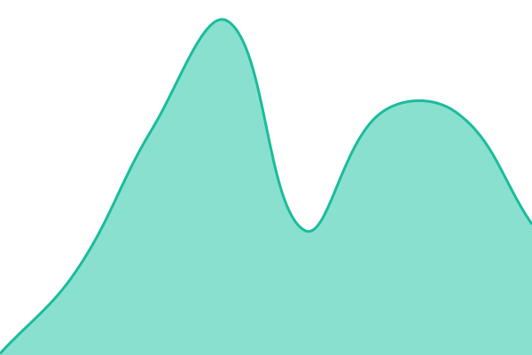 151ms
     
 | 

<a href="https://uptime.hydev.org/history/personal-projects-me">100.00%</a>
    

|  [One Among Us](https://one-among.us) | 🟩 Up | [one-among-us.yml](https://github.com/hykilpikonna/upptime/commits/HEAD/history/one-among-us.yml) | 

 145ms
     
 | 

<a href="https://uptime.hydev.org/history/one-among-us">100.00%</a>
    

|  [One Among Us Data](https://data.one-among.us) | 🟩 Up | [one-among-us-data.yml](https://github.com/hykilpikonna/upptime/commits/HEAD/history/one-among-us-data.yml) | 

 157ms
     
 | 

<a href="https://uptime.hydev.org/history/one-among-us-data">100.00%</a>
    

|  [Blog (aza.moe)](https://aza.moe) | 🟩 Up | [blog-aza-moe.yml](https://github.com/hykilpikonna/upptime/commits/HEAD/history/blog-aza-moe.yml) | 

 131ms
     
 | 

<a href="https://uptime.hydev.org/history/blog-aza-moe">100.00%</a>
    

|  [Neowofetch](https://neowofetch.hydev.org) | 🟩 Up | [neowofetch.yml](https://github.com/hykilpikonna/upptime/commits/HEAD/history/neowofetch.yml) | 

 248ms
     
 | 

<a href="https://uptime.hydev.org/history/neowofetch">100.00%</a>
    

|  [Maigo Labs](https://maigo.dev) | 🟩 Up | [maigo-labs.yml](https://github.com/hykilpikonna/upptime/commits/HEAD/history/maigo-labs.yml) | 

 200ms
     
 | 

<a href="https://uptime.hydev.org/history/maigo-labs">100.00%</a>
    

|  [Flowy (CSC301)](https://flowy.hydev.org) | 🟩 Up | [flowy-csc-301.yml](https://github.com/hykilpikonna/upptime/commits/HEAD/history/flowy-csc-301.yml) | 

 199ms
     
 | 

<a href="https://uptime.hydev.org/history/flowy-csc-301">100.00%</a>
    

<!--end: status pages-->

[**Visit our status website →**](https://uptime.hydev.org)

## 📄 License

- Powered by: [Upptime](https://github.com/upptime/upptime)
- Code: [MIT](./LICENSE) © [Anand Chowdhary](https://anandchowdhary.com), supported by [Pabio](https://pabio.com)
- Data in the `./history` directory: [Open Database License](https://opendatacommons.org/licenses/odbl/1-0/)
