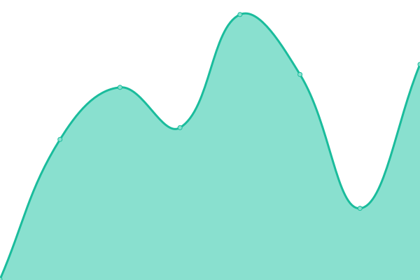
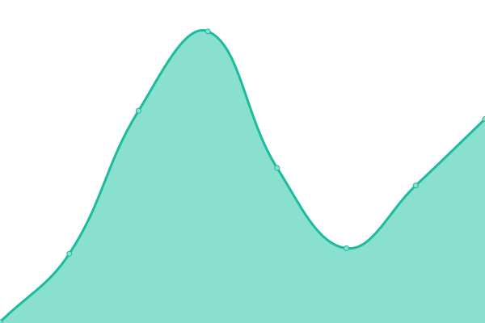

# [📈 Live Status](https://uptime.hydev.org): <!--live status--> **🟧 Partial outage**

This repository contains the open-source uptime monitor and status page for [Upptime](https://upptime.js.org), powered by [Upptime](https://github.com/upptime/upptime).

With [Upptime](https://upptime.js.org), you can get your own unlimited and free uptime monitor and status page, powered entirely by a GitHub repository. We use [Issues](https://github.com/upptime/upptime/issues) as incident reports, [Actions](https://github.com/hykilpikonna/Uptime/actions) as uptime monitors, and [Pages](https://uptime.hydev.org) for the status page.

<!--start: status pages-->
<!-- This summary is generated by Upptime (https://github.com/upptime/upptime) -->
<!-- Do not edit this manually, your changes will be overwritten -->
<!-- prettier-ignore -->
| URL | Status | History | Response Time | Uptime |
| --- | ------ | ------- | ------------- | ------ |
|  [HyDEV - Lisho](https://sh.hydev.org) | 🟩 Up | [hy-dev-lisho.yml](https://github.com/hykilpikonna/Uptime/commits/HEAD/history/hy-dev-lisho.yml) | 

 350ms
     
 | 

<a href="https://uptime.hydev.org/history/hy-dev-lisho">100.00%</a>
    

|  [HyDEV - CDN](https://cdn.hydev.org/backup/) | 🟩 Up | [hy-dev-cdn.yml](https://github.com/hykilpikonna/Uptime/commits/HEAD/history/hy-dev-cdn.yml) | 

 338ms
     
 | 

<a href="https://uptime.hydev.org/history/hy-dev-cdn">100.00%</a>
    

|  [Daisy - Whisper](https://whisper0.hydev.org/health) | 🟥 Down | [daisy-whisper.yml](https://github.com/hykilpikonna/Uptime/commits/HEAD/history/daisy-whisper.yml) | 

 363ms
     
 | 

<a href="https://uptime.hydev.org/history/daisy-whisper">64.08%</a>
    

|  [Daisy - Minecraft](https://mc.hydev.org/dynmap) | 🟥 Down | [daisy-minecraft.yml](https://github.com/hykilpikonna/Uptime/commits/HEAD/history/daisy-minecraft.yml) | 

 361ms
     
 | 

<a href="https://uptime.hydev.org/history/daisy-minecraft">64.08%</a>
    

|  [Daisy - Voice Tools Bot Backend](https://voice-backend.hydev.org) | 🟥 Down | [daisy-voice-tools-bot-backend.yml](https://github.com/hykilpikonna/Uptime/commits/HEAD/history/daisy-voice-tools-bot-backend.yml) | 

 8541ms
     
 | 

<a href="https://uptime.hydev.org/history/daisy-voice-tools-bot-backend">64.30%</a>
    

|  [Daisy - Owncast Video Streaming](https://cast.hydev.org) | 🟥 Down | [daisy-owncast-video-streaming.yml](https://github.com/hykilpikonna/Uptime/commits/HEAD/history/daisy-owncast-video-streaming.yml) | 

 8632ms
     
 | 

<a href="https://uptime.hydev.org/history/daisy-owncast-video-streaming">64.32%</a>
    

|  [Daisy - Grafana System Monitoring](https://gf.hydev.org) | 🟥 Down | [daisy-grafana-system-monitoring.yml](https://github.com/hykilpikonna/Uptime/commits/HEAD/history/daisy-grafana-system-monitoring.yml) | 

 8601ms
     
 | 

<a href="https://uptime.hydev.org/history/daisy-grafana-system-monitoring">75.67%</a>
    

|  [Daisy - ArchLinux Repo](https://arch.hydev.org) | 🟥 Down | [daisy-arch-linux-repo.yml](https://github.com/hykilpikonna/Uptime/commits/HEAD/history/daisy-arch-linux-repo.yml) | 

 224ms
     
 | 

<a href="https://uptime.hydev.org/history/daisy-arch-linux-repo">0.00%</a>
    

|  [Daisy - Slither Link](https://slither0.hydev.org) | 🟥 Down | [daisy-slither-link.yml](https://github.com/hykilpikonna/Uptime/commits/HEAD/history/daisy-slither-link.yml) | 

 8225ms
     
 | 

<a href="https://uptime.hydev.org/history/daisy-slither-link">75.70%</a>
    

|  [Daisy - 301 Backend](https://301-bk.hydev.org) | 🟥 Down | [daisy-301-backend.yml](https://github.com/hykilpikonna/Uptime/commits/HEAD/history/daisy-301-backend.yml) | 

 324ms
     
 | 

<a href="https://uptime.hydev.org/history/daisy-301-backend">75.71%</a>
    

|  [Daisy - Meetsphere](https://meet.hydev.org) | 🟥 Down | [daisy-meetsphere.yml](https://github.com/hykilpikonna/Uptime/commits/HEAD/history/daisy-meetsphere.yml) | 

 5725ms
     
 | 

<a href="https://uptime.hydev.org/history/daisy-meetsphere">0.00%</a>
    

|  [Daisy - AquaNet](https://aquadx.net) | 🟥 Down | [daisy-aqua-net.yml](https://github.com/hykilpikonna/Uptime/commits/HEAD/history/daisy-aqua-net.yml) | 

 8032ms
     
 | 

<a href="https://uptime.hydev.org/history/daisy-aqua-net">75.75%</a>
    

|  [Aster - AquaDX Server](http://aquadx.hydev.org) | 🟩 Up | [aster-aqua-dx-server.yml](https://github.com/hykilpikonna/Uptime/commits/HEAD/history/aster-aqua-dx-server.yml) | 

 5336ms
     
 | 

<a href="https://uptime.hydev.org/history/aster-aqua-dx-server">64.57%</a>
    

|  [Camellia - Sekai LLM](https://sekai.aquadx.net/llm/health) | 🟥 Down | [camellia-sekai-llm.yml](https://github.com/hykilpikonna/Uptime/commits/HEAD/history/camellia-sekai-llm.yml) | 

 537ms
     
 | 

<a href="https://uptime.hydev.org/history/camellia-sekai-llm">0.00%</a>
    

|  [Camellia - Sekai TTS](https://sekai.aquadx.net/tts/options) | 🟩 Up | [camellia-sekai-tts.yml](https://github.com/hykilpikonna/Uptime/commits/HEAD/history/camellia-sekai-tts.yml) | 

 184ms
     
 | 

<a href="https://uptime.hydev.org/history/camellia-sekai-tts">100.00%</a>
    

|  [Server - 🇨🇦 OVH Montreal](ovh.hydev.org) | 🟩 Up | [server-ovh-montreal.yml](https://github.com/hykilpikonna/Uptime/commits/HEAD/history/server-ovh-montreal.yml) | 

 49ms
     
 | 

<a href="https://uptime.hydev.org/history/server-ovh-montreal">100.00%</a>
    

|  [Server - 🇨🇦 Bell Toronto 'Daisy'](https://daisy-ddns.hydev.org/health/) | 🟩 Up | [server-bell-toronto-daisy.yml](https://github.com/hykilpikonna/Uptime/commits/HEAD/history/server-bell-toronto-daisy.yml) | 

 179ms
     
 | 

<a href="https://uptime.hydev.org/history/server-bell-toronto-daisy">64.58%</a>
    

|  [Server - 🇱🇺 GCore Luxembourg](lux.hydev.org) | 🟩 Up | [server-g-core-luxembourg.yml](https://github.com/hykilpikonna/Uptime/commits/HEAD/history/server-g-core-luxembourg.yml) | 

 134ms
     
 | 

<a href="https://uptime.hydev.org/history/server-g-core-luxembourg">100.00%</a>
    

|  [MCPRS - Bell](https://mcprs.hydev.org) | 🟩 Up | [mcprs-bell.yml](https://github.com/hykilpikonna/Uptime/commits/HEAD/history/mcprs-bell.yml) | 

 7782ms
     
 | 

<a href="https://uptime.hydev.org/history/mcprs-bell">64.61%</a>
    

|  [GH - Veracross Analyzer Demo](https://demo.vera.hydev.org) | 🟩 Up | [gh-veracross-analyzer-demo.yml](https://github.com/hykilpikonna/Uptime/commits/HEAD/history/gh-veracross-analyzer-demo.yml) | 

 104ms
     
 | 

<a href="https://uptime.hydev.org/history/gh-veracross-analyzer-demo">100.00%</a>
    

|  [GH - Arcaea Steps Calculator](https://arcaea.hydev.org) | 🟩 Up | [gh-arcaea-steps-calculator.yml](https://github.com/hykilpikonna/Uptime/commits/HEAD/history/gh-arcaea-steps-calculator.yml) | 

 172ms
     
 | 

<a href="https://uptime.hydev.org/history/gh-arcaea-steps-calculator">100.00%</a>
    

|  [GH - Base 3000](https://b3k.hydev.org) | 🟩 Up | [gh-base-3000.yml](https://github.com/hykilpikonna/Uptime/commits/HEAD/history/gh-base-3000.yml) | 

 182ms
     
 | 

<a href="https://uptime.hydev.org/history/gh-base-3000">100.00%</a>
    

|  [GH - Cellular Automata](https://cellular.hydev.org) | 🟩 Up | [gh-cellular-automata.yml](https://github.com/hykilpikonna/Uptime/commits/HEAD/history/gh-cellular-automata.yml) | 

 130ms
     
 | 

<a href="https://uptime.hydev.org/history/gh-cellular-automata">100.00%</a>
    

|  [GH - CSC110 Research Report](https://csc110.hydev.org/) | 🟩 Up | [gh-csc-110-research-report.yml](https://github.com/hykilpikonna/Uptime/commits/HEAD/history/gh-csc-110-research-report.yml) | 

 147ms
     
 | 

<a href="https://uptime.hydev.org/history/gh-csc-110-research-report">100.00%</a>
    

|  [GH - Clash Proxy Config](https://clash.hydev.org/clash.yml) | 🟩 Up | [gh-clash-proxy-config.yml](https://github.com/hykilpikonna/Uptime/commits/HEAD/history/gh-clash-proxy-config.yml) | 

 148ms
     
 | 

<a href="https://uptime.hydev.org/history/gh-clash-proxy-config">100.00%</a>
    

|  [GH - NyaaMemo Demo](https://nyaa.hydev.org/) | 🟩 Up | [gh-nyaa-memo-demo.yml](https://github.com/hykilpikonna/Uptime/commits/HEAD/history/gh-nyaa-memo-demo.yml) | 

 221ms
     
 | 

<a href="https://uptime.hydev.org/history/gh-nyaa-memo-demo">100.00%</a>
    

<!--end: status pages-->

[**Visit our status website →**](https://uptime.hydev.org)

## 📄 License

- Powered by: [Upptime](https://github.com/upptime/upptime)
- Code: [MIT](./LICENSE) © [Upptime](https://upptime.js.org)
- Data in the `./history` directory: [Open Database License](https://opendatacommons.org/licenses/odbl/1-0/)
